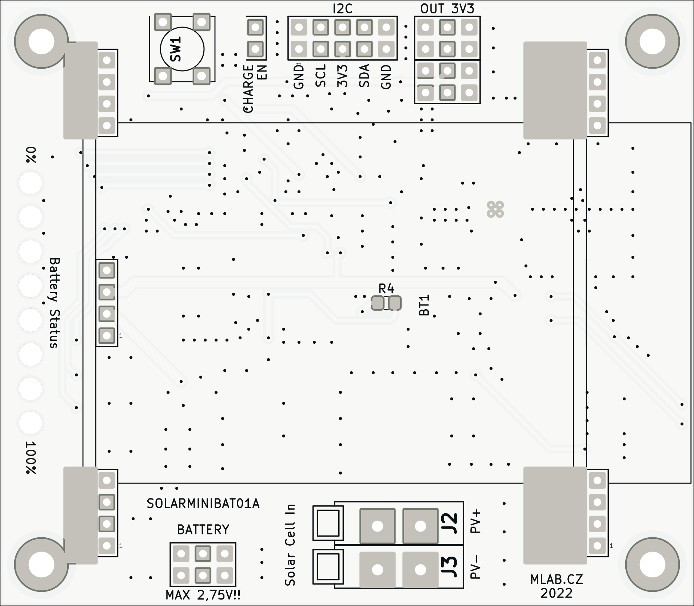
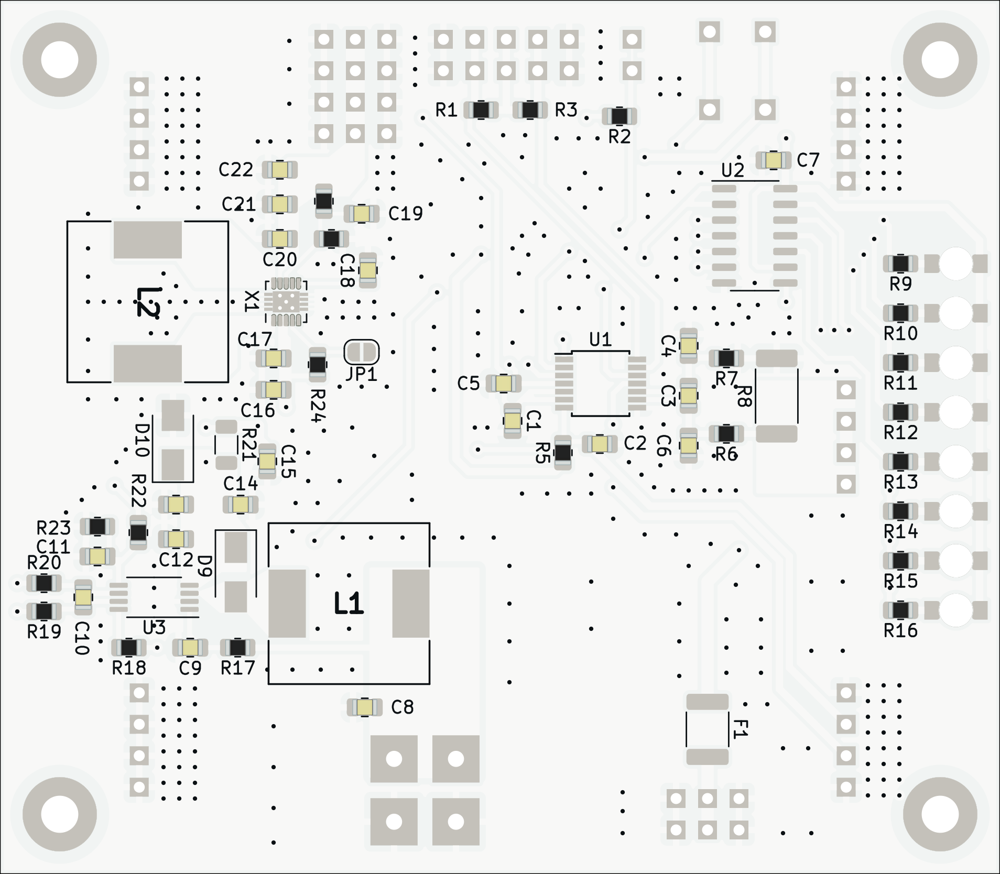

# SOLARMINIBAT01

  
   

Battery module with [LTO cells](https://files.gwl.eu/inc/_doc/attach/StoItem/7015/GWL_LTO1865_Rechargeable.pdf). This module was primarily designed for use in autonomous outdoor devices powered by a solar cell. This is possible thanks to the use of LTO cells, which have a wide range of operating conditions and require minimal care. The device can therefore work in outdoor conditions all year round (tested in Central European conditions). 

### Features:
 * LTO batteries (4x LTO1865) cells
   * 1.3 Ah (per cell)
 * MPPT tracker for LTO batteries charging from solar cell
 * Battery gauge for battery charge state measurement
   * I2C interface
   * LED indication
 * Output switching voltage regulator
   *  Standard output voltage 3v3

## Schematics

