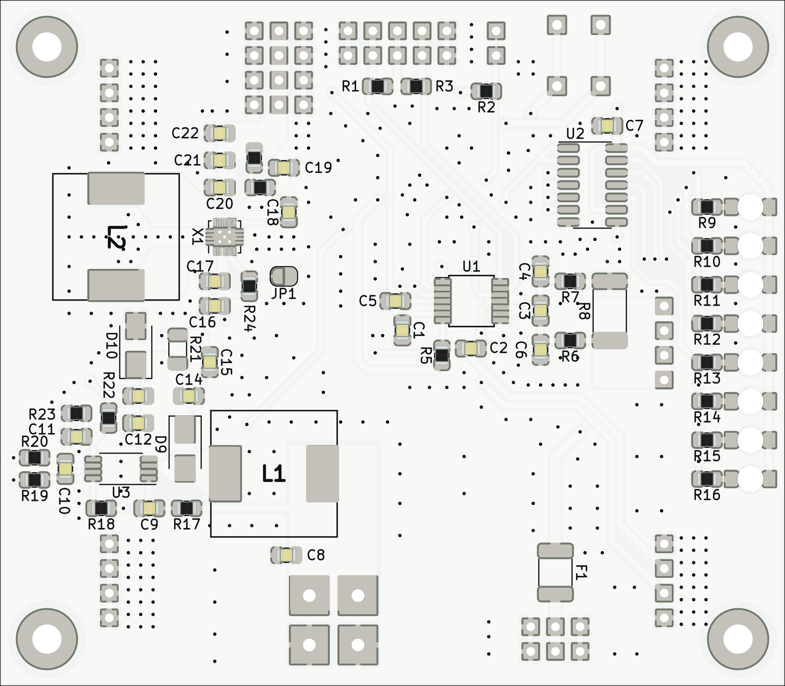
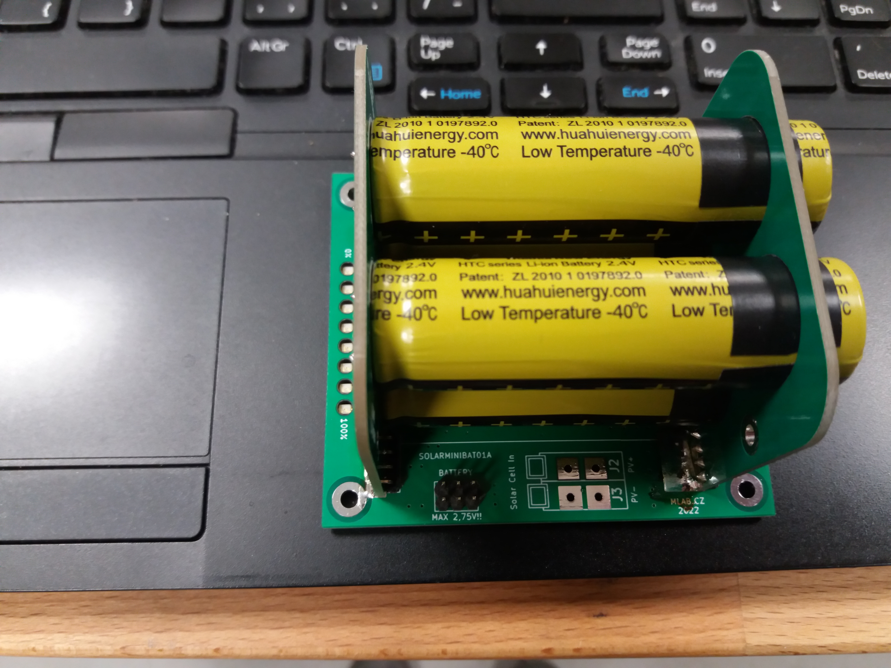

# SOLARMINIBAT01

Battery module with [LTO cells](https://files.gwl.eu/inc/_doc/attach/StoItem/7015/GWL_LTO1865_Rechargeable.pdf). This module was primarily designed for use in autonomous outdoor devices powered by a solar cell. This is possible thanks to the use of LTO cells, which have a wide range of operating conditions and require minimal care. The device can therefore work in outdoor conditions all year round (tested in Central European conditions). 

